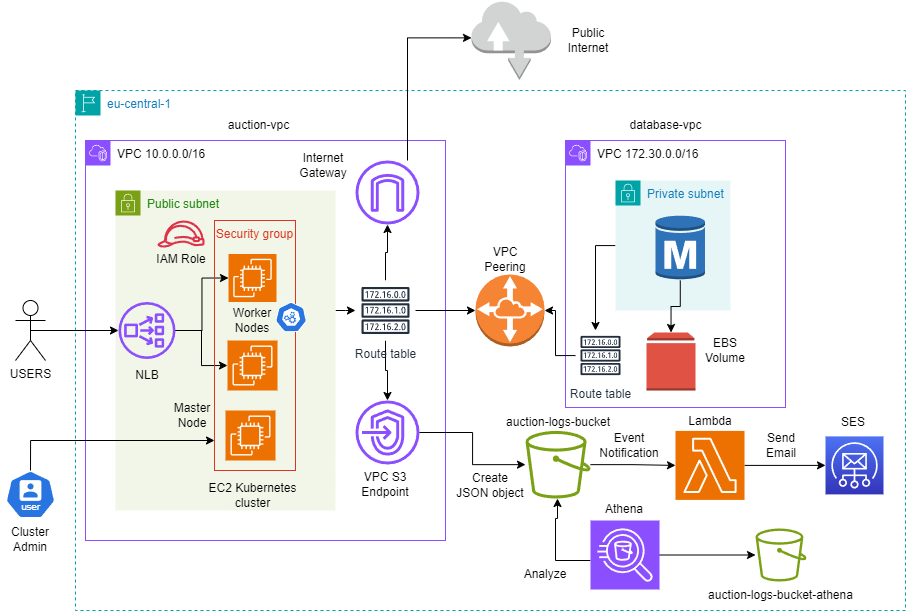
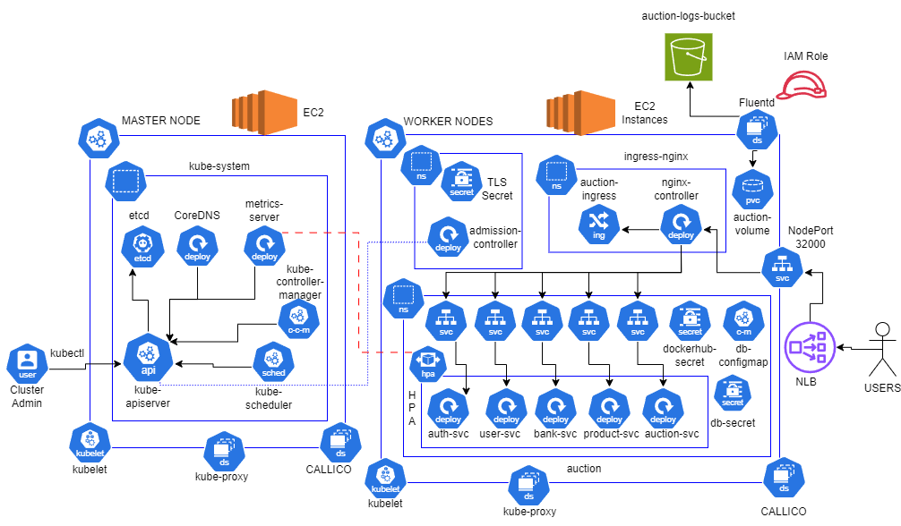
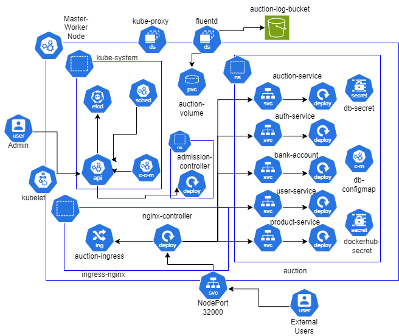

# Auction Platform

A microservices-based online auction system built with Spring Boot and deployed on Kubernetes, with full infrastructure-as-code on AWS. Built as a hands-on project to practice production-style backend and DevOps patterns: centralized auth at the ingress layer, service-to-service communication via Feign, a custom Kubernetes admission controller, and a log pipeline feeding S3/Athena/Lambda for analytics and notifications.

## Table of Contents

- [System Overview](#system-overview)
- [Architecture Diagrams](#architecture-diagrams)
- [Authentication & Authorization](#authentication--authorization)
- [Microservices](#microservices)
- [Admission Controller](#admission-controller)
- [Kubernetes Infrastructure](#kubernetes-infrastructure)
- [AWS Infrastructure](#aws-infrastructure)
- [Logging & Analytics](#logging--analytics)
- [Running Locally](#running-locally)
- [Deploying to AWS](#deploying-to-aws)
- [Skills Demonstrated](#skills-demonstrated)
- [Possible Improvements](#possible-improvements)

---

## System Overview

Every HTTP request passes through **ingress-nginx**, which forwards it to **AuthService** for validation. Once identity and permissions are confirmed, the request is proxied to the target microservice with `X-Auth-Email` and `X-Auth-Role` headers attached. AuctionService writes structured JSON logs that **Fluentd** ships to S3, where **Athena** makes them queryable and **Lambda** triggers email notifications via SES.

### Tech Stack

| Category | Technologies |
|---|---|
| Backend | Java 17, Spring Boot 3, Spring Cloud OpenFeign |
| Database | PostgreSQL, AWS RDS (t3.micro) |
| Containerization | Docker, containerd |
| Orchestration | Kubernetes 1.29 (kubeadm), Kustomize |
| Infrastructure | Terraform, AWS EC2 / VPC / NLB / RDS / SSM Parameter Store / S3 |
| Networking (CNI) | Calico, BGP + IPIP encapsulation between nodes |
| Ingress | ingress-nginx on NodePort 31000 |
| Admission Control | Python, Mutating Webhook |
| Logging | Fluentd DaemonSet, AWS S3, AWS Athena |
| Notifications | AWS Lambda, AWS SES |
| Monitoring | metrics-server, HorizontalPodAutoscaler |
| Coordination | AWS SSM Parameter Store |

---

## Architecture Diagrams

Hand-drawn diagrams covering the three layers of the system: AWS infrastructure, the production Kubernetes cluster running on EC2, and the local Minikube setup used for development.

### AWS Infrastructure

VPC layout, networking, and the log-processing pipeline (S3 → Lambda → SES, S3 → Athena).



### Production Cluster (AWS)

Full cluster topology on EC2: master/worker nodes, control plane components, ingress-nginx, the admission controller, per-service HPAs, and the Fluentd DaemonSet shipping logs to S3.



### Local Cluster (Minikube)

The same application stack running on a single-node Minikube cluster for local development — same ingress/admission-controller/microservice layout, minus the AWS-specific pieces (HPA, RDS, S3 shipping).



---

## Authentication & Authorization

Authentication is centralized at the ingress layer using the ingress-nginx `auth-url` annotation. AuthService acts as an external auth provider — it validates every request before it reaches any microservice.

### Request Flow

1. The client sends a request with an `Authorization: Basic <base64(email:password)>` header.
2. ingress-nginx intercepts the request and forwards it to `POST /validate` on AuthService, along with the original Authorization header and request path.
3. AuthService decodes the Base64 credentials, calls UserService via a Feign client to look up the user, verifies the BCrypt password hash, and checks a permission map to confirm whether that user's role can access the given path and HTTP method.
4. On success, AuthService returns `HTTP 200` and ingress attaches `X-Auth-Email` / `X-Auth-Role` headers to the original request before forwarding it downstream. On failure, it returns `HTTP 401`.

### Role-Based Permissions

| Endpoint | USER | ADMIN |
|---|---|---|
| `GET /users` | ✗ | ✓ |
| `GET /users/email` | ✓ | ✓ |
| `POST /users/newUser` · `POST /users/newAdmin` | ✗ | ✓ |
| `PUT /users` · `DELETE /users` | ✓ | ✓ |
| `GET /bankAccounts` | ✗ | ✓ |
| `GET /bankAccounts/email` | ✓ | ✓ |
| `PUT /bankAccounts` | ✗ | ✓ |
| `GET /products` · `/products/id` · `/products/email` | ✓ | ✓ |
| `POST /products` · `PUT /products/id` · `DELETE /products/id` | ✓ | ✗ |
| `GET /auctions` · `/auctions/status` · `/auctions/id` · `/auctions/email` | ✓ | ✓ |
| `POST /auctions` · `/auctions/join/id` · `/auctions/cancel/id` · `/auctions/finish/id` | ✓ | ✗ |
| `GET /auctions/participant` · `/participant/email` · `/participant/id` | ✓ | ✓ |
| `POST /bids` · `GET /bids/my-bids` | ✓ | ✗ |
| `GET /bids/auction/id` | ✓ | ✓ |

---

## Microservices

### AuthService — port 8880
Central authentication/authorization gateway. Not exposed to clients directly — only called internally by ingress-nginx as the external auth provider for every incoming request. Decodes credentials, verifies them against UserService, and checks the permission map.

### UserService — port 8770
Manages user accounts (`USER` / `ADMIN` roles). Creating a `USER` automatically provisions a zero-balance bank account (EUR/USD/RSD) via BankAccountService. Deleting a user cascades: checks for products on active auctions, then removes their products, bank account, and finally the user record itself.

**Key endpoints:** `GET/POST/PUT/DELETE /users`, `/users/newUser`, `/users/newAdmin`

### BankAccountService — port 8200
Handles user balances across three currencies (EUR/USD/RSD). Only ADMINs can update balances directly through the API; AuctionService calls it internally for all auction-related financial transactions (deposits, payouts, refunds).

**Key endpoints:** `GET/PUT /bankAccounts`

### ProductService — port 8300
Manages auction listings. Each product tracks an `ownerEmail`, which is transferred to the winning bidder when an auction closes. Only `USER` role can create/manage products.

**Key endpoints:** `GET/POST/PUT/DELETE /products`

### AuctionService — port 8400
The core of the system — manages the full auction lifecycle, coordinates financial transactions through BankAccountService, transfers product ownership through ProductService, and writes structured JSON logs for completed/cancelled auctions.

**Auction lifecycle:**
```
POST /auctions          → auction created, status OPEN
POST /auctions/join/id  → participant pays a 10% deposit
POST /bids               → bids must exceed both startPrice and the current highest bid
POST /auctions/cancel/id → owner cancels, deposits refunded to all participants
POST /auctions/finish/id → owner closes; winner is charged, others refunded,
                            product ownership transferred, JSON log written
```

**Key endpoints:** `GET/POST /auctions`, `/auctions/join`, `/cancel`, `/finish`, `POST /bids`, `GET /bids/my-bids`, `/bids/auction/id`

### ServiceLibrary
Shared Maven library included as a dependency across all microservices — holds common DTOs, enums (`Currency`, `Role`, `Status`), and Feign proxy interfaces. Avoids duplicating contract code between services.

### Util
Shared exception-handling library. A single `@ControllerAdvice`-based `GlobalExceptionHandler` catches ~25 custom exceptions across all services (e.g. insufficient funds, unauthorized edits, invalid currency, product already on auction) and maps them to consistent JSON error responses.

---

## CI/CD

This project uses **GitHub Actions** for continuous integration. On every push to `main`, a workflow automatically detects which microservice(s) were changed, builds their Docker images, and pushes them to Docker Hub — so only the affected services are rebuilt instead of the entire stack.

Workflow file: [`.github/workflows/main-build-push.yml`](.github/workflows/main-build-push.yml)

## Admission Controller

A Mutating Webhook implemented in Python (Flask). The Kubernetes API server calls it automatically whenever a new pod is created in the `auction` namespace, before the pod is scheduled.

The webhook receives an `AdmissionReview` object, inspects every container in the pod spec, and generates a JSON Patch that injects a `securityContext`:
- `runAsNonRoot: true`
- `runAsUser: 7777`
- `capabilities.drop: [ALL]`

This means individual Deployment manifests don't need to define their own `securityContext` — it's enforced cluster-wide automatically. TLS certs/CA are generated by a setup script and stored as a Kubernetes Secret; the CA bundle is registered in the `MutatingWebhookConfiguration` so the API server can verify the webhook.

---

## Kubernetes Infrastructure

Built with **Kustomize** — a single `base/` configuration is shared between local (Minikube) and production (AWS), with environment-specific differences applied as patches in `overlays/local` and `overlays/prod`, rather than maintaining duplicate manifest sets.

**Base includes:** Deployments and ClusterIP Services for every microservice, the admission controller deployment/service, Ingress rules (with the `auth-url` annotation routing everything through AuthService), a NetworkPolicy restricting access to AuthService, a namespace-wide `LimitRange` (500m CPU / 512Mi memory default), the Fluentd DaemonSet + ConfigMap, and a CronJob that purges old log files from node disks.

**Local overlay:** swaps RDS for a PostgreSQL pod, disables the Fluentd S3 output, and runs the webhook setup script for Minikube.

**Prod overlay:** patches `DB_HOST` to the RDS endpoint, patches the Ingress host to the NLB DNS name, adds HPAs per service (min 1 / max 3 replicas, 70% CPU threshold, tuned stabilization windows to avoid false scale events from JVM startup CPU spikes), and defines `PriorityClass` tiers for critical vs. non-critical services.

---

## AWS Infrastructure

Fully defined in Terraform — `terraform apply` provisions everything from scratch in a few minutes; `terraform destroy` tears it down while preserving the RDS instance between cycles.

**Provisions:** a VPC (`10.0.0.0/16`) with a public subnet and Internet Gateway; security groups for master/worker nodes (API server, kubelet, Calico BGP/IPIP, SSH, NodePort range); three EC2 instances (1 master + 2 workers) with IAM roles and cloud-init bootstrap scripts; an internet-facing Network Load Balancer forwarding to NodePort 31000; VPC peering to the RDS VPC; and a Gateway VPC Endpoint for S3 (so Fluentd ships logs over AWS's internal network instead of the public internet — cheaper and more secure than a NAT Gateway).

**Node coordination:** the master node's cloud-init script runs `kubeadm init`, installs Calico, and stores the join command in **SSM Parameter Store**. Worker nodes poll SSM until the join command is available, then run `kubeadm join` — this avoids race conditions between master/worker boot scripts without needing a shared filesystem.

### Cluster Topology

| Resource | Spec |
|---|---|
| VPC | 10.0.0.0/16, eu-central-1 |
| Master node | m7i-flex.large, 4 vCPU, 8 GB RAM |
| Worker node 1 | m7i-flex.large, 4 vCPU, 8 GB RAM |
| Worker node 2 | t3.medium, 2 vCPU, 4 GB RAM |
| NLB | Internet-facing, TCP:80 → NodePort 31000 |
| RDS | PostgreSQL t3.micro, private subnet |
| Pod CIDR | 192.168.0.0/16 (Calico) |
| Service CIDR | 10.96.0.0/12 |

---

## Logging & Analytics

AuctionService writes a structured JSON log for every completed or cancelled auction. The Fluentd DaemonSet tails these files and ships them to S3, where they're queryable via Athena and trigger email alerts via Lambda + SES.

```
AuctionLoggerService.java  →  writes JSON to /var/log/auction/auctions/
        │
        ▼
Fluentd DaemonSet  →  reads via hostPath volume, ships to S3
        │
        ▼
AWS S3 (via VPC Gateway Endpoint — no public internet)
        │
        ├── S3 Event → Lambda → SES  (email on every new log file)
        └── Athena   →  SQL queries directly over the JSON files
                         (JsonSerDe, no ETL required)
```

**Sample log entry:**
```json
{
  "eventType": "AUCTION_COMPLETED",
  "timestamp": "2026-03-05T16:37:54Z",
  "auctionId": 4,
  "productName": "STIT",
  "sellerEmail": "seller@example.com",
  "winnerEmail": "buyer@example.com",
  "winningBid": 500.0,
  "startPrice": 400.0,
  "currency": "EUR",
  "totalBids": 3,
  "totalParticipants": 2
}
```

**Example Athena query:**
```sql
SELECT currency, SUM(winningBid) AS total_revenue
FROM auction_logs.app_logs
WHERE eventType = 'AUCTION_COMPLETED'
GROUP BY currency;
```

---

## Running Locally

**Prerequisites:** Docker Desktop, Minikube, kubectl, Java 17, Maven

```bash
minikube start
cd k8s/overlays/local

./webhook-setup.sh      # generates TLS cert, creates Secret, deploys webhook + MWC
kubectl apply -k .

kubectl get pods -n auction
kubectl get pods -n mutating-webhook
```

Or, with Docker Compose:
```bash
docker-compose up -d
```

## Deploying to AWS

**Prerequisites:** AWS CLI (`aws configure`), Terraform, an RDS PostgreSQL instance with an `auctionDB` database.

```bash
cd terraform
terraform init
terraform apply
# wait ~5 minutes for the cluster to bootstrap

cd ../k8s/overlays/prod
./webhook-setup.sh
kubectl apply -k .
```

**Accessing the cluster remotely:**
```bash
# Copy /etc/kubernetes/admin.conf from the master node,
# replace server: https://PRIVATE_IP:6443 with the public IP

export KUBECONFIG=~/.kube/ec2-config
kubectl get nodes
```

**Teardown:**
```bash
cd terraform
terraform destroy
# RDS and VPC peering are preserved — remove manually via the AWS console if needed
```

---

## Skills Demonstrated

- Designing and deploying a multi-service Spring Boot system with inter-service communication via OpenFeign
- Centralized auth-at-the-edge pattern using ingress-nginx `auth-url`
- Kubernetes: Kustomize overlays, NetworkPolicy, LimitRange, HPA, PriorityClass
- Writing a custom Kubernetes Mutating Admission Webhook from scratch (Python/Flask)
- Infrastructure as Code with Terraform (VPC, EC2, IAM, NLB, RDS, VPC Peering, Gateway Endpoints)
- CNI-level networking with Calico (BGP/IPIP)
- Building a log pipeline: Fluentd → S3 → Athena (SQL analytics) → Lambda → SES
